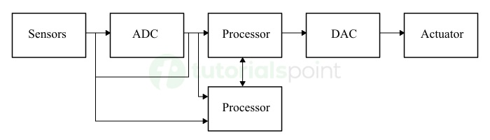
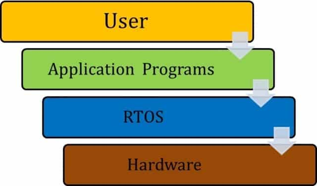
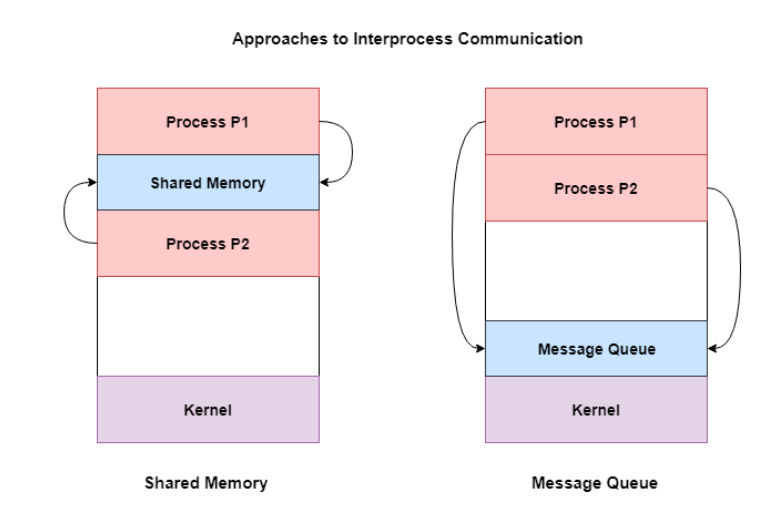

# **RTOS Assignment - 01**

## **[QUESTIONS](https://github.com/manakcodes/sem-6/blob/804c112cade0cdf77651dde0b3749c2c2c39be95/assignments/rtos-assignment/rtos-assignment-01-questions.jpg)**

```text
***** NOTE *****

> Subject Code: HS-304

> Assignment Date:
[monday, 23 february, 2026]

> Assignment Deadline:
[friday, 27 february, 2026]

> NOTE:
submit the assignment on plain A4 sheets
```

## Question 1: Explain Embedded Systems and Their Applications in Detail.

### 1. Definition of an Embedded System

An **Embedded System** is a controller programmed and controlled by a real-time operating system (RTOS) with a dedicated function within a larger mechanical or electrical system. Unlike a General-Purpose Computer (like a PC) which is designed to perform a wide variety of tasks, an embedded system is designed to do **one specific task** (or a small range of tasks) efficiently, reliably, and often under strict time constraints.

### Core Components:

- **Hardware:** Includes the Microcontroller (MCU) or Microprocessor (MPU), memory (ROM/RAM), and I/O peripherals.
- **Software (Firmware):** The application code, often running on an RTOS, which dictates how the hardware reacts to external stimuli.
- **Real-Time Constraints:** Many embedded systems are "Real-Time," meaning the correctness of the system depends not only on the logical result but also on the **time** at which the result is produced.

### 2. Key Characteristics

- **Single-Functioned:** Executes a specific program repeatedly.
- **Tightly Constrained:** Operates with limited resources (low power consumption, small memory footprint, and limited computing speed).
- **Reactive and Real-Time:** Many must constantly react to sensors and compute results in "real-time" without delay.
- **High Reliability:** Often used in mission-critical environments where a system failure could be catastrophic (e.g., flight controls).

### 3. Applications of Embedded Systems

Embedded systems are ubiquitous, categorized largely by their environment and criticality:

#### A. Consumer Electronics

- **Smart Home Devices:** Thermostats (Nest), smart bulbs, and security cameras.
- **Wearables:** Smartwatches and fitness trackers that process biometric data in real-time.
- **Household Appliances:** Microwave ovens, washing machines, and dishwashers use embedded controllers to manage cycles and sensors.

#### B. Automotive Systems

Modern vehicles contain over 100 embedded systems, often referred to as Electronic Control Units (ECUs):

- **Engine Control Units:** Optimize fuel injection and ignition timing.
- **Safety Systems:** Anti-lock Braking Systems (ABS), Airbag deployment, and Adaptive Cruise Control.
- **Infotainment:** GPS navigation and dashboard displays.

#### C. Industrial Automation

- **Robotics:** Controllers that manage the precise movement of robotic arms on assembly lines.
- **PLCs (Programmable Logic Controllers):** Used to monitor sensors and control actuators in manufacturing plants.

#### D. Medical Technology

- **Life Support:** Pacemakers and ventilators where timing is life-critical.
- **Imaging:** MRI and CT scan machines that process massive amounts of sensor data to create images.

#### E. Aerospace and Defense

- **Flight Control Systems:** Managing the stability of an aircraft.
- **Guidance Systems:** Used in missiles and satellites for trajectory correction.

### 4. Conclusion

Embedded systems form the "nervous system" of modern technology. Their move toward increased connectivity (the Internet of Things or IoT) and higher processing power continues to blur the line between simple controllers and complex computing nodes, though the requirement for **determinism** and **efficiency** remains their defining feature.



---

## Question 2: Write detailed note on Real-Time Operating Systems (RTOS) along with its diagram

### 1. Introduction to RTOS

A **Real-Time Operating System (RTOS)** is an operating system intended to serve real-time applications that process data as it comes in, typically without buffer delays. The key characteristic of an RTOS is the nature of its **scheduling algorithm**, which is designed to ensure that a specific task is completed within a strictly defined time constraint (deadline).

### 2. Core Components of an RTOS

To provide predictability, an RTOS consists of several specialized components:

#### A. The Scheduler

The heart of the RTOS. It decides which task runs next based on priority or time slices. Unlike general OS schedulers, an RTOS scheduler is **preemptive**, meaning it can immediately stop a lower-priority task to run a higher-priority one.

#### B. Kernel

The core that manages the hardware and software interactions. It handles:

- **Task Management:** Creation, deletion, and state transitions.
- **Inter-process Communication (IPC):** Semaphores, Mutexes, and Queues.
- **Memory Management:** Often uses static allocation to avoid the unpredictability of "garbage collection."

#### C. Interrupt Handler

Prioritizes hardware signals to ensure that critical external events (like a sensor trigger) are serviced immediately with minimal **latency**.

### 3. RTOS Architecture and Task States

In an RTOS, a task is typically in one of four states. The transition between these states is managed by the kernel's scheduler.

#### The Four States:

1. **Running:** The task currently utilizing the CPU.
2. **Ready:** Tasks that are prepared to run but are waiting for the CPU because a higher-priority task is currently running.
3. **Blocked/Waiting:** Tasks waiting for an external event (e.g., a timer to expire or a semaphore to be released).
4. **Suspended:** Tasks that have been manually stopped and will not run until explicitly "resumed."

### 4. Classifications of RTOS

RTOS systems are classified by the "harshness" of their deadlines:

- **Hard Real-Time:** Missing a deadline results in total system failure (e.g., Airbag deployment, Satellite guidance).
- **Firm Real-Time:** Missing a deadline makes the result useless, but the system doesn't necessarily crash (e.g., Video broadcast frames).
- **Soft Real-Time:** Missing a deadline is undesirable but acceptable; the performance just degrades (e.g., Digital camera shutter sound, PC gaming).

### 5. RTOS System Architecture Diagram

A typical RTOS sits between the application software and the hardware, acting as the manager of resources to ensure timing.

### 6. Advantages of using an RTOS

- **Determinism:** Predictable response times.
- **Task Isolation:** If one task crashes, the scheduler can often maintain the rest of the system.
- **Efficiency:** Minimal overhead compared to general-purpose operating systems.
- **Modular Development:** Allows developers to write complex systems as independent, manageable tasks.

### 7. Popular Examples

- **FreeRTOS:** Open-source and widely used in microcontrollers.
- **VxWorks:** Used in high-end aerospace (e.g., Mars Rovers).
- **QNX:** Common in automotive dashboards and medical devices.
- **RT-Linux:** A real-time extension for the Linux kernel.

## 

## Question 3: Difference between RTOS and GPOS

### 1. Overview

- **GPOS (General Purpose Operating System):** Designed for human interaction and multitasking. It aims to provide a good user experience by distributing resources across many applications (e.g., Windows, macOS, Linux).
- **RTOS (Real-Time Operating System):** Designed for high-precision tasks where timing is as important as the logical result. It is used in embedded systems where failure to meet a deadline is considered a system failure.

### 2. Key Differences Comparison Table

| Feature               | GPOS (e.g., Windows, Linux)           | RTOS (e.g., FreeRTOS, QNX)                |
| :-------------------- | :------------------------------------ | :---------------------------------------- |
| **Primary Goal**      | Throughput (Doing more work)          | Determinism (Doing work on time)          |
| **Scheduling**        | Fairness-based (Everyone gets a turn) | Priority-based (Important tasks go first) |
| **Interrupt Latency** | Unpredictable and relatively high     | Minimal and predictable                   |
| **Kernel Type**       | Large, complex (Monolithic)           | Small, fast (Microkernel)                 |
| **Task Switching**    | Slower (Significant overhead)         | Very fast (Minimal overhead)              |
| **Determinism**       | Non-deterministic                     | Highly deterministic                      |
| **Hardware**          | Requires powerful CPUs/RAM            | Runs on minimal hardware (MCUs)           |

### 3. Core Technical Distinctions

#### A. Determinism vs. Throughput

In a **GPOS**, the OS tries to maximize the total amount of work done by the CPU. If you open a web browser while a file is downloading, the OS splits the time. In an **RTOS**, the system is **deterministic**, meaning you can mathematically prove that a task will finish within a specific timeframe ($t$), regardless of what else is happening.

#### B. Scheduling Algorithms

- **GPOS Schedulers:** Use "Time Slicing" or "Fairness" algorithms. The goal is to ensure no single application "freezes" the computer.
- **RTOS Schedulers:** Use "Preemptive Priority-Based" scheduling. If a high-priority task (like a sensor trigger) needs the CPU, the kernel stops the current task **immediately** to let the high-priority task run.

#### C. Interrupt Latency

In a GPOS, if the kernel is busy with a system update, it might delay responding to a hardware interrupt. In an RTOS, **Interrupt Latency** is kept to an absolute minimum. The system is designed to respond to external hardware events almost instantaneously.

#### D. Complexity and Footprint

- A **GPOS** includes complex GUIs, file systems, and drivers for thousands of devices, requiring gigabytes of storage.
- An **RTOS** is "stripped down" to only the essential features, often fitting into a few kilobytes of memory.

### 4. Use Case Examples

- **Use GPOS when:** You need to run a database, browse the web, edit videos, or perform tasks where a 100ms delay won't cause a crash.
- **Use RTOS when:** You are building an Anti-lock Braking System (ABS), a flight controller, or a medical ventilator where a 1ms delay could be fatal.

### 5. Summary

The fundamental difference is **Predictability**. A GPOS is fast on average, but an RTOS is guaranteed to be fast enough, every single time.

---

## Question 4: Write a short note on Interprocess Communication (IPC) in RTOS

### 1. Introduction

**Interprocess Communication (IPC)** refers to the mechanisms provided by an operating system that allow different tasks (or processes) to communicate with each other and synchronize their execution. In a Real-Time Operating System, IPC is critical for coordinating tasks that depend on each other's data or timing.

### 2. Why IPC is Necessary

- **Data Sharing:** One task (e.g., a sensor reader) needs to pass data to another task (e.g., a data logger).
- **Task Synchronization:** A task might need to wait for another task to finish a specific action before it can proceed.
- **Resource Management:** Ensuring that two tasks do not try to use the same hardware resource (like a UART port) at the exact same time.

### 3. Common IPC Mechanisms

#### A. Semaphores

Semaphores are signaling mechanisms used for synchronization.

- **Binary Semaphore:** Acts like a flag (0 or 1). Used to synchronize a task with an interrupt.
- **Counting Semaphore:** Used when a resource has multiple instances (e.g., a buffer with 5 slots).

#### B. Mutexes (Mutual Exclusion)

A Mutex is a special type of binary semaphore used to manage "shared resources." It has the concept of **ownership**—only the task that "locks" the mutex can "unlock" it. This is vital for preventing data corruption in shared memory.

#### C. Message Queues

Queues allow tasks to send and receive messages (data packets) in a First-In-First-Out (FIFO) manner. They provide a way to pass actual data values between tasks asynchronously.

- **Producer:** Task that sends the data to the queue.
- **Consumer:** Task that reads the data from the queue.

#### D. Shared Memory

The fastest way to communicate. Multiple tasks point to the same area in RAM. However, this requires a **Mutex** to ensure two tasks don't write to the same address simultaneously (Race Condition).

#### E. Mailboxes and Event Flags

- **Mailboxes:** A simplified version of a queue, usually holding a single message.
- **Event Flags/Groups:** Allow a task to wait for a specific combination of conditions (e.g., "Wait until Sensor A is active AND Timer B has expired").

### 4. Challenges in RTOS IPC

While IPC is powerful, it introduces risks that the RTOS must manage:

1. **Deadlock:** Two tasks waiting for each other to release a resource, causing the system to freeze.
2. **Priority Inversion:** A high-priority task is blocked by a low-priority task that holds a required mutex.

### 5. Summary

IPC mechanisms are the "glue" of an RTOS. Choosing the right one—whether it's a simple **Semaphore** for signaling or a **Message Queue** for data transfer—is essential for maintaining the system's timing and reliability.



---

## Question 5: Explain the following RTOS

- FreeRTOS
- RT-Linux
- VxWorks

### 1. FreeRTOS

**FreeRTOS** is a market-leading, open-source real-time operating system kernel designed specifically for microcontrollers. It is managed by Amazon Web Services (AWS) and is famous for being extremely "lightweight."

- **Key Features:**
  - **Small Footprint:** The core kernel is only about 6KB to 10KB in size.
  - **Portability:** Written almost entirely in C, making it easy to move between different hardware like ARM, AVR, and ESP32.
  - **Task Management:** Supports both preemptive and cooperative scheduling.
  - **Ecosystem:** Comes with libraries for IoT connectivity (TCP/IP, MQTT, and OTA updates).
- **Applications:** IoT devices, smart home appliances, and low-power wearable technology.

### 2. RT-Linux (Real-Time Linux)

**RT-Linux** is not a separate OS, but rather a specialized version of Linux designed to handle hard real-time tasks. It typically uses a "dual-kernel" approach where a small real-time kernel run directly on the hardware and treats the standard Linux OS as its lowest-priority task.

- **Key Features:**
  - **Determinism + Power:** Combines the hard real-time precision of an RTOS with the massive library and driver support of standard Linux.
  - **Dual-Kernel Architecture:** The real-time kernel handles critical interrupts immediately, while Linux handles non-critical tasks like the GUI or networking.
  - **Open Source:** Highly customizable and cost-effective for industrial use.
- **Applications:** Industrial robotics, data acquisition systems, and complex telecommunication infrastructure.

### 3. VxWorks

Developed by Wind River Systems, **VxWorks** is one of the most commercially successful and "mission-critical" RTOS in the world. It is known for its extreme reliability and security certifications.

- **Key Features:**
  - **Hard Real-Time Performance:** Offers exceptional determinism and very low interrupt latency.
  - **Fault Isolation:** Uses memory protection and "Time and Space Partitioning" to ensure that if one task fails, it cannot crash the rest of the system.
  - **High Scalability:** Can run on anything from a small 32-bit MCU to a complex 64-bit multi-core processor.
- **Applications:** Mars Rovers (Pathfinder, Curiosity, Perseverance), Boeing 787 Dreamliner flight systems, and nuclear power plant controllers.

### 4. Summary Comparison Table

| Feature         | FreeRTOS        | RT-Linux            | VxWorks                   |
| :-------------- | :-------------- | :------------------ | :------------------------ |
| **Type**        | Open Source     | Open Source / Patch | Proprietary (Commercial)  |
| **Hardware**    | Low-power MCUs  | High-end CPUs       | Wide Range (MCUs to CPUs) |
| **Footprint**   | Extremely Small | Large               | Scalable (Small to Large) |
| **Primary Use** | Consumer IoT    | Industrial Control  | Aerospace & Defense       |
